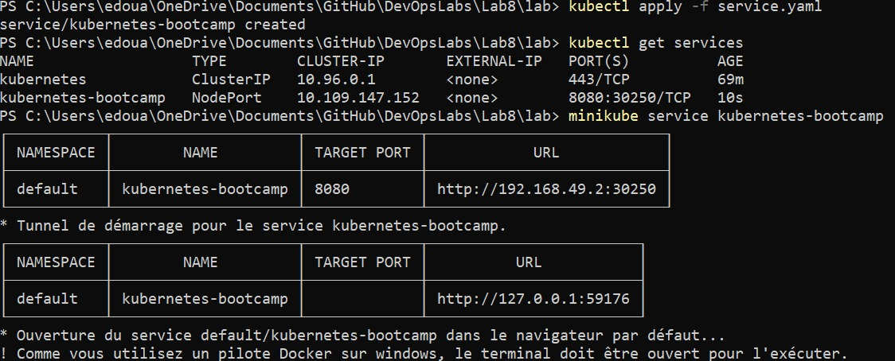
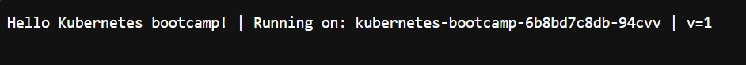
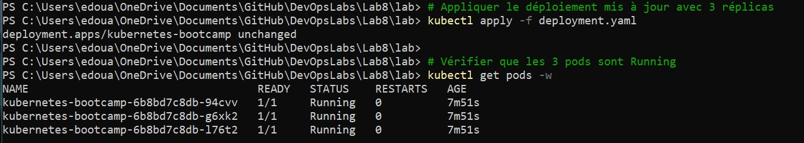

 Lab – Container Orchestration with Kubernetes


Nom : 

1️- Install Minikube
 Objectif

Installer et lancer un cluster Kubernetes local.
```bash
minikube start
minikube status
```


2️- Learn to use kubectl commands
 Objectif
Créer et manipuler un pod Kubernetes.

2.1 Create Deployment


Créer un deployment contenant un pod avec une application Node.js.

```bash
kubectl create deployment kubernetes-bootcamp --image=gcr.io/google-samples/kubernetes-bootcamp:v1
```


Utilisation des commandes de base : 


2.2 List Pods
Explication
Vérifier que le pod est bien lancé.

```bash
kubectl get pods

```

2.3 Logs
 Explication

Afficher les logs du pod.

```bash
kubectl logs $POD_NAME
```


 
2.4 Execute Command in Pod
Explication

Voir les informations système du conteneur.

```bash
kubectl exec $POD_NAME -- cat /etc/os-release
```

--
2.5 Open Shell
 Explication

Accéder au shell du conteneur.

```bash
kubectl exec -ti $POD_NAME -- bash
```

2.6 Find server.js
 Explication

Trouver le fichier server.js pour connaître le port utilisé.


```bash
ls
find / -name "server.js" 2>/dev/null
```


2.7 Test App Inside Pod
 Explication

Tester l’application avec curl.

```bash
curl localhost:<PORT>

```

 Question

Are you able to query the web app outside of the pod?

 Réponse :
(à compléter)

3️- Expose Kubernetes Service
 Objectif

Rendre l’application accessible depuis l’extérieur.

3.1 Expose Deployment
```bash
kubectl expose deployment kubernetes-bootcamp --type="NodePort" --port=8080

```

3.2 Get Services
```bash
kubectl get services

```


3.3 Get Minikube IP
```bash
minikube ip

```
.jpeg)
3.4 Access Application
 Explication

Accéder via navigateur :

http://<MINIKUBE_IP>:<NODE_PORT>


4️- Scale Deployment
 Objectif

Gérer le nombre de pods.

4.1 Scale Up
```bash
kubectl scale deployments/kubernetes-bootcamp --replicas=5

```

 Question

Which command did you use?

Cette commande dit à Kubernetes : “Je veux 5 pods pour ce déploiement”. kubectl get pods est celle qui permet de vérifier le nombre de pods et leur état.

4.2 Refresh Behaviour

What is happening? Why?

 Réponse :
(à compléter)

4.3 Scale Down
```bash
kubectl scale deployments/kubernetes-bootcamp --replicas=2

```


5️-  Update and Rollback
 Objectif

Mettre à jour l’application et comprendre le rollback.

5.1 Update v2

```bash
kubectl set image deployments/kubernetes-bootcamp kubernetes-bootcamp=jocatalin/kubernetes-bootcamp:v2
```

 Screenshot

Question

What happened?
Observation dans le navigateur :

Si tu rafraîchis avec CTRL+F5 pendant le déploiement, certaines pages peuvent s’afficher avec l’ancienne version et d’autres avec la nouvelle.

Pourquoi ? → Kubernetes met à jour les pods progressivement (rolling update). Les anciens pods répondent encore jusqu’à ce que les nouveaux soient prêts.

5.2 Update v3
```bash
kubectl set image deployments/kubernetes-bootcamp kubernetes-bootcamp=jocatalin/kubernetes-bootcamp:v3
kubectl set image deployments/kubernetes-bootcamp kubernetes-bootcamp=jocatalin/kubernetes-bootcamp:v3
kubectl get pods
```


 List all of the running pods, what is happening here?
 The new pods are failing to start.
We can see errors such as ErrImagePull and ImagePullBackOff.

This means Kubernetes is unable to download the Docker image (invalid or unavailable image).

5.3 Rollback
```bash
kubectl rollout undo deployments/kubernetes-bootcamp
```


```bash
kubectl rollout status deployment/kubernetes-bootcamp
kubectl get pods
```
Roll back the service to the image we first chose in part 2 of the lab.
The rollback restores the previous working version of the application (v2).
All pods return to a stable Running state and the application becomes accessible again.


6️- Deployment with YAML
 Objectif

Déployer avec des fichiers YAML.

6.1 Apply Deployment
```bash
kubectl apply -f deployment.yaml
```


 Question

Are the pods running?

 Oui avec succès

6.2 Apply Service
```bash
kubectl apply -f service.yaml
```


 Question

Can you access the service?

Yes, the service is accessible through the browser using the Minikube URL.

6.3 Scale to 3 Replicas
```bash
kubectl apply -f service.yaml
kubectl get services
minikube service kubernetes-bootcamp
```






 Question

Are you hitting different replicas?

 Yes. By refreshing the browser multiple times, the hostname changes.
This shows that requests are being distributed across different replicas (load balancing).


 Cleanup
```bash
kubectl delete service kubernetes-bootcamp
kubectl delete deployment kubernetes-bootcamp
minikube stop
```

