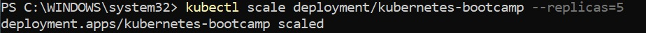
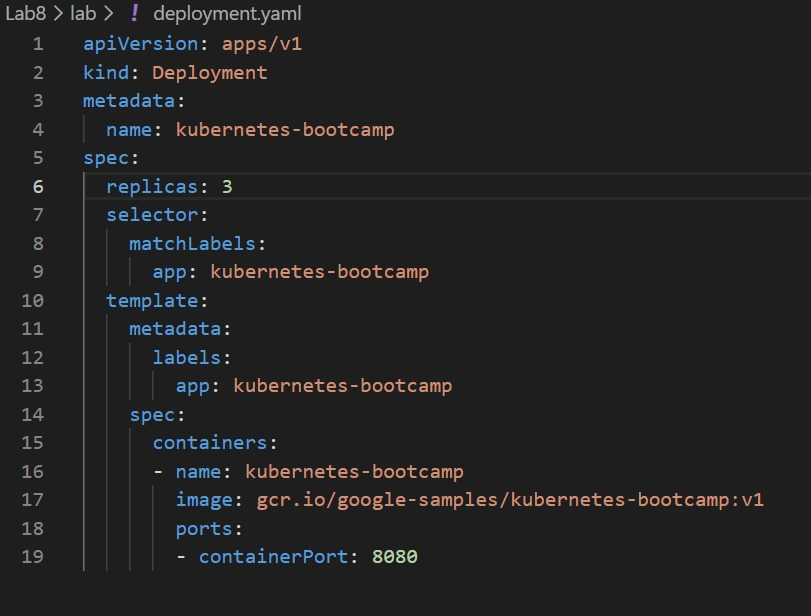
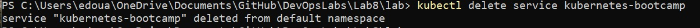
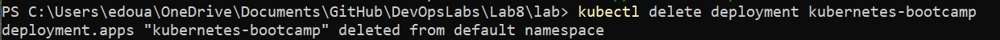
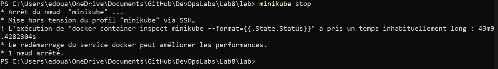

 Lab – Container Orchestration with Kubernetes


Nom : Clara Chalayer 
Edouard Menut
Chloe Lestic 

1️- Install Minikube
 Objectif

Installer et lancer un cluster Kubernetes local.
```bash
minikube start
minikube status
```


2️- Learn to use kubectl commands
 Objectif

Créer et manipuler un pod Kubernetes.

2.2 Create Deployment


Créer un deployment contenant un pod avec une application Node.js.

```bash
kubectl create deployment kubernetes-bootcamp --image=gcr.io/google-samples/kubernetes-bootcamp:v1
```


Utilisation des commandes de base : 


2.3 List Pods
Explication
Vérifier que le pod est bien lancé.

```bash
kubectl get pods

```


2.4 Logs
 Explication

Afficher les logs du pod.

```bash
kubectl logs $POD_NAME
```


 

2.5 Execute Command in Pod
Explication

Voir les informations système du conteneur.

```bash
kubectl exec $POD_NAME -- cat /etc/os-release
```

--
2.6 Open Shell
 Explication

Accéder au shell du conteneur.

```bash
kubectl exec -ti $POD_NAME -- bash
```

2.7 Find server.js
 

Trouver le fichier server.js pour connaître le port utilisé.


```bash
ls
find / -name "server.js" 2>/dev/null
```


2.8 Test App Inside Pod

Tester l’application avec curl.

```bash
curl localhost:<PORT>

```


 2.9 Are you able to query the web app outside of the pod?

Oui il est possible d'interroger l'application web depuis l'exterieur du pod, a condition qu'elle soit correctement exposée. 

3️- Expose Kubernetes Service
 

Rendre l’application accessible depuis l’extérieur.

3.1 Expose Deployment

```bash
kubectl expose deployment kubernetes-bootcamp --type="NodePort" --port=8080

```


3.2 Get Services

```bash
kubectl get services

```


3.3 Get Minikube IP
```bash
minikube ip

```
.jpeg)

3.4 Access Application
 

Accéder via navigateur :

http://<MINIKUBE_IP>:<NODE_PORT>


4️- Scale Deployment

Gérer le nombre de pods.

4.1 Scale Up
```bash
kubectl scale deployments/kubernetes-bootcamp --replicas=5

```



4.2 Which command did you use?

Cette commande dit à Kubernetes : “Je veux 5 pods pour ce déploiement”. kubectl get pods est celle qui permet de vérifier le nombre de pods et leur état.


4.3 What is happening? Why?

Quand on rafraîchit la page plusieurs fois, la réponse change. L’application est maintenant exécutée sur plusieurs pods (5 pods après le scale up). À chaque rafraîchissement, la requête est envoyée vers un pod différent.

Cela se produit parce que le Service Kubernetes utilise un load balancing : il répartit automatiquement les requêtes entre tous les pods du déploiement. 


```bash
kubectl scale deployments/kubernetes-bootcamp --replicas=2

```


4.4 Scale Down


5️-  Update and Rollback
 

Mettre à jour l’application et comprendre le rollback.

5.1/2 Update v2

```bash
kubectl set image deployments/kubernetes-bootcamp kubernetes-bootcamp=jocatalin/kubernetes-bootcamp:v2
```


5.3 What happened?


Si on rafraîchis avec CTRL+F5 pendant le déploiement, certaines pages peuvent s’afficher avec l’ancienne version et d’autres avec la nouvelle.

Car Kubernetes met à jour les pods progressivement (rolling update). Les anciens pods répondent encore jusqu’à ce que les nouveaux soient prêts.


5.4 Update v3
```bash
kubectl set image deployments/kubernetes-bootcamp kubernetes-bootcamp=jocatalin/kubernetes-bootcamp:v3
kubectl set image deployments/kubernetes-bootcamp kubernetes-bootcamp=jocatalin/kubernetes-bootcamp:v3
kubectl get pods
```


 5.5 List all of the running pods, what is happening here?

Les nouveaux pods n’arrivent pas à démarrer.
On peut voir des erreurs comme ErrImagePull et ImagePullBackOff.
Cela signifie que Kubernetes n’arrive pas à télécharger l’image Docker (image invalide ou indisponible).


5.6 Rollout 
```bash
kubectl rollout undo deployments/kubernetes-bootcamp
```


5.7 Rollback 

```bash
kubectl rollout status deployment/kubernetes-bootcamp
kubectl get pods
```
Roll back the service to the image we first chose in part 2 of the lab.

Le rollback restaure la version précédente fonctionnelle de l’application (v2).
Tous les pods reviennent à un état stable Running et l’application redevient accessible.


6️- Deployment with YAML

Déployer avec des fichiers YAML.

6.1 Apply Deployment
```bash
kubectl apply -f deployment.yaml
```


Are the pods running?

 Oui avec succès

6.2 Apply Service
```bash
kubectl apply -f service.yaml
```


6.3 Scale to 3 Replicas
```bash
kubectl apply -f service.yaml

```

6.4 


6.5 Can you access the service?

Oui, le service est accessible via le navigateur en utilisant l’URL fournie par Minikube.


6.6 Modification du code service 



6.7


Are you hitting different replicas?

Oui. En rafraîchissant le navigateur plusieurs fois, le nom d’hôte change.
Cela montre que les requêtes sont réparties entre différentes réplicas (répartition de charge).


 Cleanup

```bash
kubectl delete service kubernetes-bootcamp
```



```bash
kubectl delete deployment kubernetes-bootcamp
```



```bash

minikube stop
```


