 Lab – Container Orchestration with Kubernetes


Nom : 

1️- Install Minikube
 Objectif

Installer et lancer un cluster Kubernetes local.
```bash
minikube start
minikube status
```


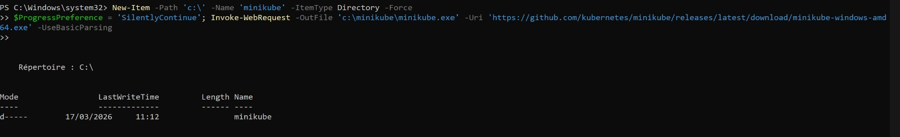


2️- Learn to use kubectl commands
 Objectif
Créer et manipuler un pod Kubernetes.

2.1 Create Deployment


Créer un deployment contenant un pod avec une application Node.js.

```bash
kubectl create deployment kubernetes-bootcamp --image=gcr.io/google-samples/kubernetes-bootcamp:v1
```

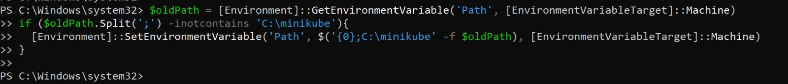
Utilisation des commandes de base : 

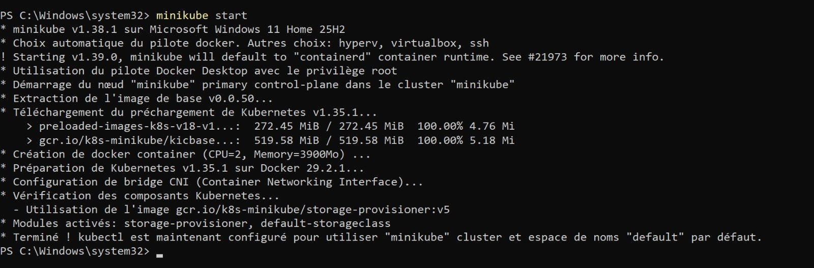
2.2 List Pods
Explication
Vérifier que le pod est bien lancé.

```bash
kubectl get pods

```
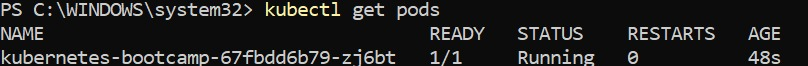
2.3 Logs
 Explication

Afficher les logs du pod.

```bash
kubectl logs $POD_NAME
```


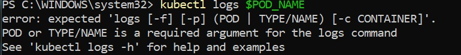 
2.4 Execute Command in Pod
Explication

Voir les informations système du conteneur.

```bash
kubectl exec $POD_NAME -- cat /etc/os-release
```

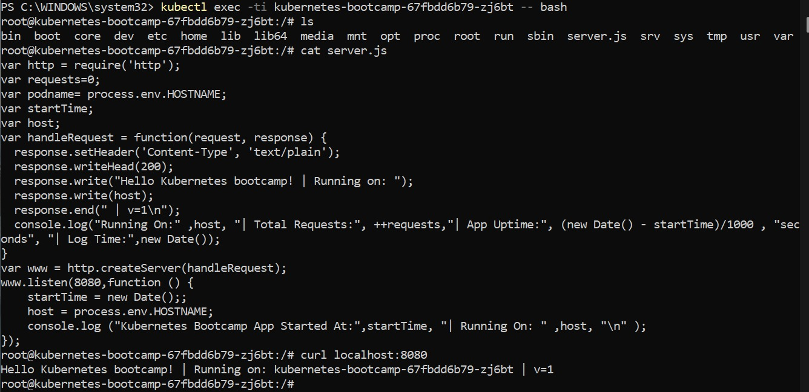--
2.5 Open Shell
 Explication

Accéder au shell du conteneur.

```bash
kubectl exec -ti $POD_NAME -- bash
```


--
2.6 Find server.js
 Explication

Trouver le fichier server.js pour connaître le port utilisé.


```bash
ls
find / -name "server.js" 2>/dev/null
```

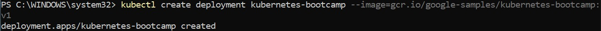
2.7 Test App Inside Pod
 Explication

Tester l’application avec curl.

```bash
curl localhost:<PORT>

```

 Question

Are you able to query the web app outside of the pod?

 Réponse :
(à compléter)

3️- Expose Kubernetes Service
 Objectif

Rendre l’application accessible depuis l’extérieur.

3.1 Expose Deployment
```bash
kubectl expose deployment kubernetes-bootcamp --type="NodePort" --port=8080

```
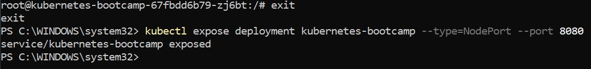
3.2 Get Services
```bash
kubectl get services

```

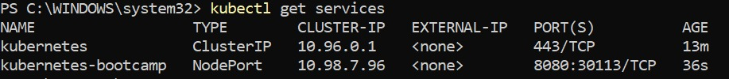
3.3 Get Minikube IP
```bash
minikube ip

```
.jpeg)
3.4 Access Application
 Explication

Accéder via navigateur :

http://<MINIKUBE_IP>:<NODE_PORT>
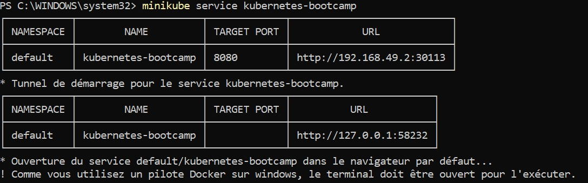

4️- Scale Deployment
 Objectif

Gérer le nombre de pods.

4.1 Scale Up
```bash
kubectl scale deployments/kubernetes-bootcamp --replicas=5

```
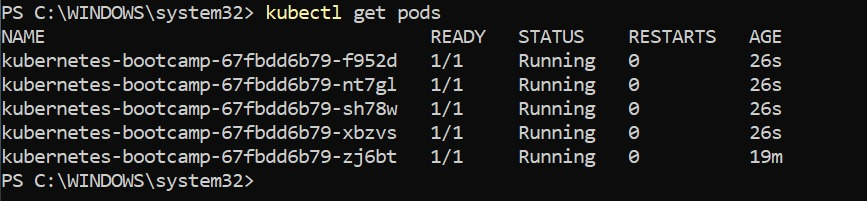
 Question

Which command did you use?

Réponse :
(à compléter)

4.2 Refresh Behaviour
 Question

What is happening? Why?

 Réponse :
(à compléter)

4.3 Scale Down
```bash
kubectl scale deployments/kubernetes-bootcamp --replicas=2

```

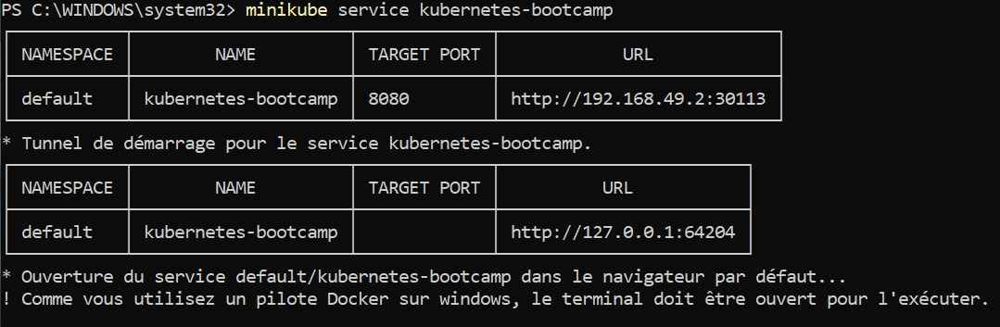
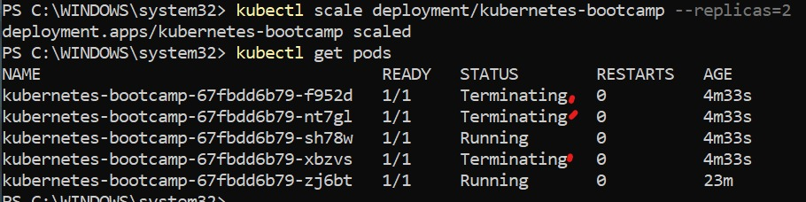
5️-  Update and Rollback
 Objectif

Mettre à jour l’application et comprendre le rollback.

5.1 Update v2
Observation dans le navigateur :

Si tu rafraîchis avec CTRL+F5 pendant le déploiement, certaines pages peuvent s’afficher avec l’ancienne version et d’autres avec la nouvelle.

Pourquoi ? → Kubernetes met à jour les pods progressivement (rolling update). Les anciens pods répondent encore jusqu’à ce que les nouveaux soient prêts.
```bash
kubectl set image deployments/kubernetes-bootcamp kubernetes-bootcamp=jocatalin/kubernetes-bootcamp:v2
```

 Screenshot
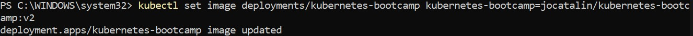
Question

What happened?

 Réponse :
(à compléter)

5.2 Update v3
```bash
kubectl set image deployments/kubernetes-bootcamp kubernetes-bootcamp=jocatalin/kubernetes-bootcamp:v3
```


 Question

What is happening?

 Réponse :
(à compléter)

5.3 Rollback
```bash
kubectl rollout undo deployments/kubernetes-bootcamp
```


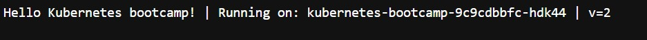
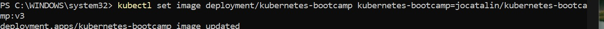
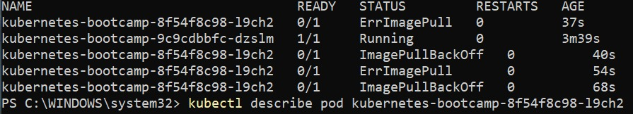
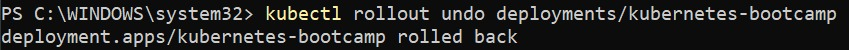
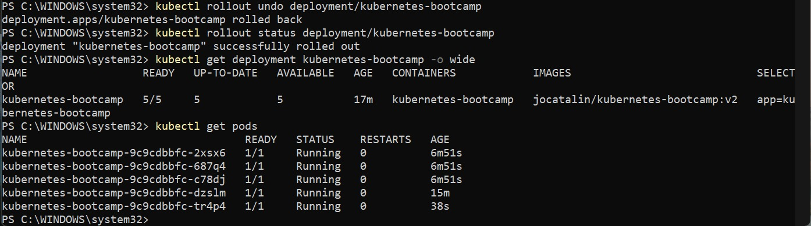


6️- Deployment with YAML
 Objectif

Déployer avec des fichiers YAML.

6.1 Apply Deployment
```bash
kubectl apply -f deployment.yaml
```


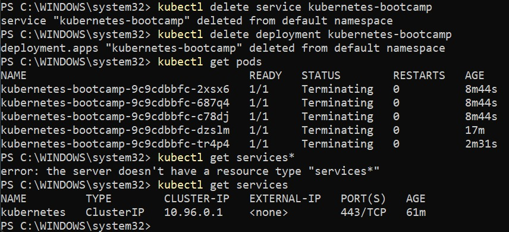
 Question

Are the pods running?

 Réponse :
(à compléter)

6.2 Apply Service
```bash
kubectl apply -f service.yaml
```


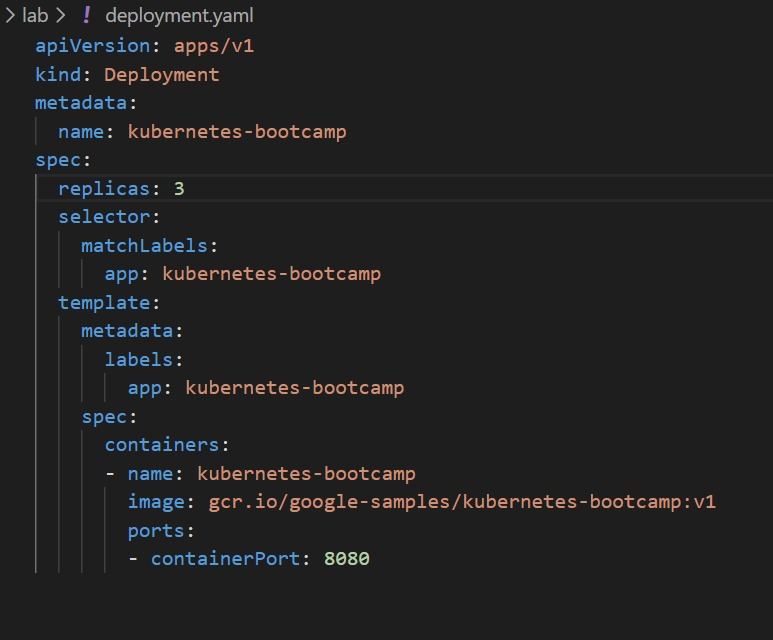
 Question

Can you access the service?

 Réponse :
(à compléter)

6.3 Scale to 3 Replicas
```bash
kubectl apply -f deployment.yaml
```
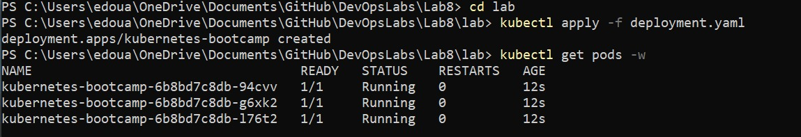
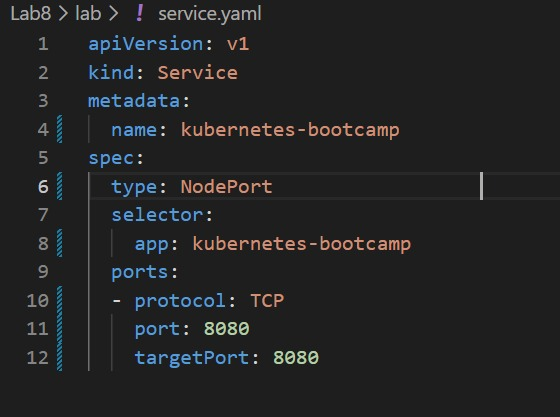


 Question

Are you hitting different replicas?

 Réponse :
(à compléter)

 Cleanup
```bash
kubectl delete service kubernetes-bootcamp
kubectl delete deployment kubernetes-bootcamp
minikube stop
```

