# Lab 4 — Infrastructure as Code (IaC) avec Vagrant & Ansible

## Objectif du Lab

Ce lab a pour objectif d’apprendre les principes de l’Infrastructure as Code (IaC) à travers :

- **Partie 1 : Approche impérative** (Vagrant + Shell Provisioner)
- **Partie 2 : Approche déclarative** (GitLab avec Vagrant + Ansible)
- **Partie 3 : Health Checks GitLab**
- Bonus

---


### Installation des outils

- VirtualBox
- Vagrant

### Désactiver Hyper-V (Windows)

Dans PowerShell (admin) :

```powershell
Disable-WindowsOptionalFeature -Online -FeatureName Microsoft-Hyper-V-All
```

---

#  Avant de commencer

Ajouter la box CentOS 7 :

```bash
vagrant box add centos/7
```

Choisir :

```
3) virtualbox
```

---

# PARTIE 1 — Approche Impérative (Vagrant + Shell)

## 1. Préparation

Se placer dans :

```bash
cd lab/part-1
```

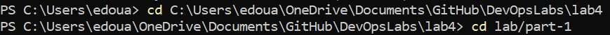
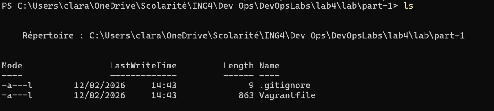 

---

## 2. Création de la VM

```bash
vagrant up
```

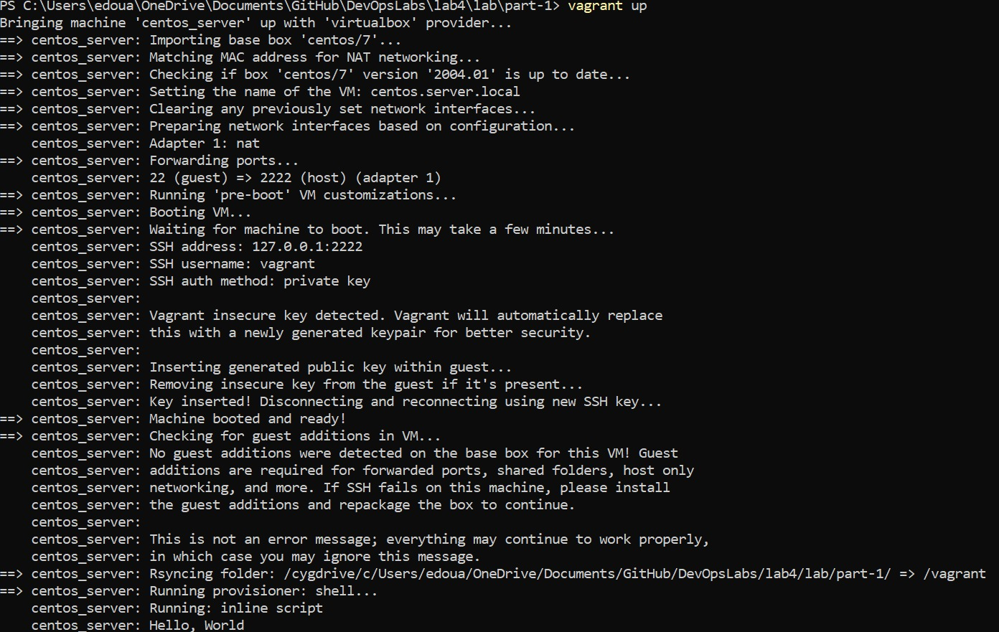

Vérification dans VirtualBox :

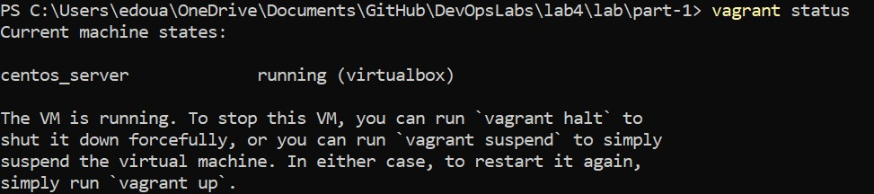

---

## 3. Commandes utiles

```bash
vagrant status
vagrant halt
vagrant destroy
```

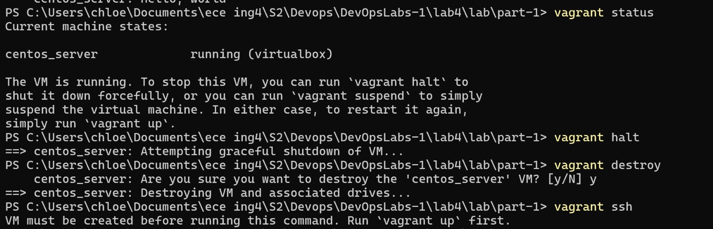

---

## 4. Connexion SSH

```bash
vagrant ssh
```

Commandes Linux :

```bash
ls
pwd
```

 
  


---

## 5. Shell Provisioner — Modifier /etc/hosts

Dans le `Vagrantfile` :

```ruby
config.vm.provision "shell",
  inline: "echo '127.0.0.1  mydomain-1.local' >> /etc/hosts"
```

Puis :

```bash
vagrant provision
```

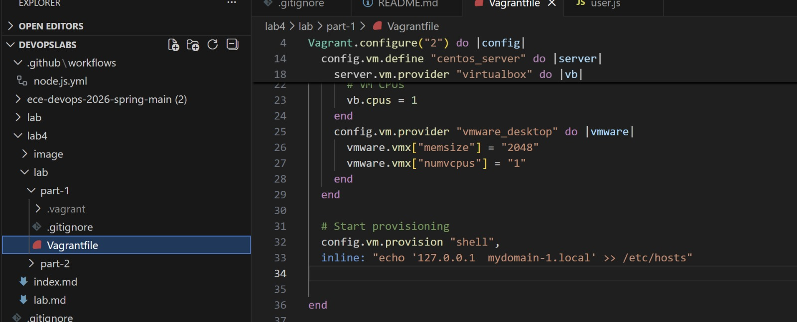  
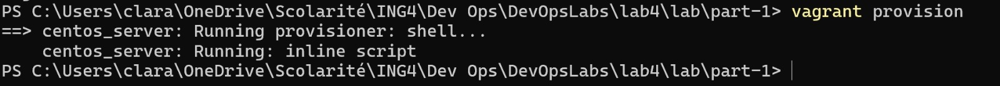

Vérification :

```bash
vagrant ssh
cat /etc/hosts
```


---

## 6. Shell Provisioner — Écrire la date

```ruby
$script = <<-SCRIPT
echo I am provisioning...
date > /etc/vagrant_provisioned_at
SCRIPT

config.vm.provision "shell", inline: $script
```

Puis :

```bash
vagrant provision
```

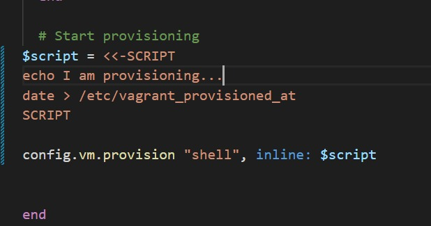  
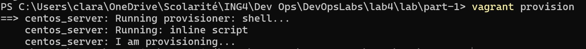

---

## 7. Gestion d’erreurs

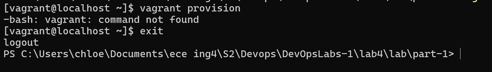

---

# PARTIE 2 — Approche Déclarative (GitLab + Ansible)

## Principe

Utilisation de `ansible_local` :

- Ansible est installé dans la VM
- Configuration décrite dans des playbooks YAML
- Infrastructure reproductible

---

## 1. Préparation

```bash
cd lab/part-2
```

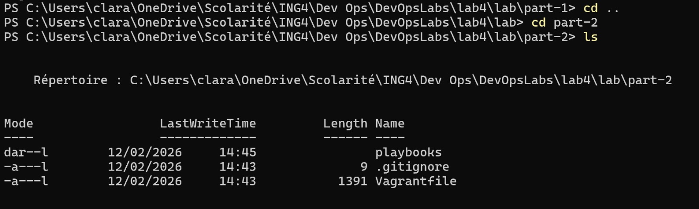  
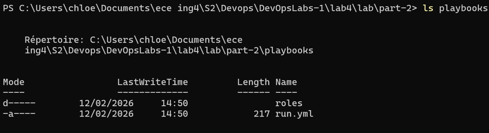

---

## 2. Lancement GitLab

```bash
vagrant up
```

Cette étape installe :

- curl
- SSH
- Firewall
- IPv6
- Postfix
- GitLab CE
- Base de données

---

## 3. Test navigateur

Ouvrir :

```
http://localhost:8080
```

Si la page GitLab apparaît :

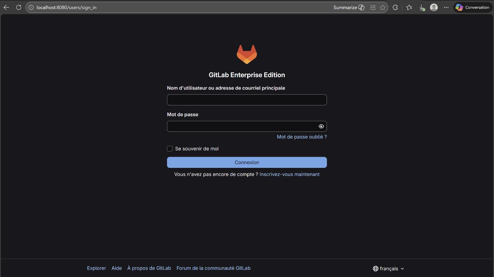

---

## 4. Mot de passe root

Dans la VM :

```bash
vagrant ssh
sudo cat /etc/gitlab/initial_root_password
```

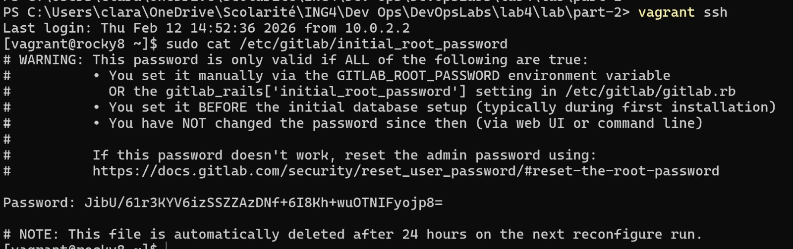

---

## 5. Mise à jour des playbooks

```bash
vagrant upload playbooks /vagrant/playbooks gitlab_server
vagrant provision
```

---

# PARTIE 3 — Health Checks GitLab

## 1. Test simple

```bash
vagrant ssh
curl http://127.0.0.1:8080/-/health
```

Résultat attendu :

```
GitLab OK
```

---

## 2. Lancer les healthchecks via Ansible

Lister les tags :

```bash
ansible-playbook /vagrant/playbooks/run.yml \
  --list-tags \
  -i /tmp/vagrant-ansible/inventory/vagrant_ansible_local_inventory
```

Lancer un tag :

```bash
ansible-playbook /vagrant/playbooks/run.yml \
  --tags healthcheck \
  -i /tmp/vagrant-ansible/inventory/vagrant_ansible_local_inventory
```

Même chose pour :

- readiness
- liveness

---

## Vérification finale

```bash
vagrant status
```

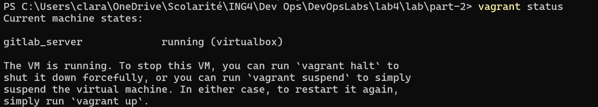

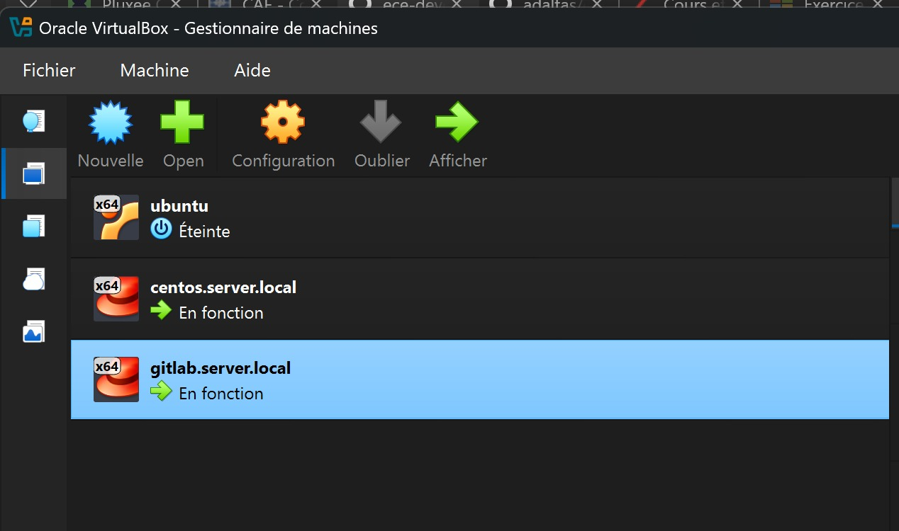

---

# Conclusion

Ce lab montre la différence entre :

## Approche Impérative
- Commandes exécutées directement
- Moins reproductible

## Approche Déclarative
- État final décrit
- Automatisation complète
- Infrastructure reproductible
- Meilleure maintenabilité

L’association de **Vagrant + Ansible** permet de créer une infrastructure fiable, portable et automatisée.

---
