# Projet DevOps

## Table des matières
1. [Application Web](#1-application-web)
2. [Tests Automatisés](#2-tests-automatisés)
3. [Structure du Projet](#3-structure-du-projet)
4. [Pipeline CI/CD](#4-pipeline-cicd)
5. [Vagrant](#5-vagrant)
6. [Ansible](#6-ansible)
7. [Docker](#7-docker)
8. [Kubernetes](#8-kubernetes)
9. [Difficultés Rencontrées](#9-difficultés-rencontrées)
10. [Auteurs](#10-auteurs)

---

## 1. Application Web

### Description

Nous avons développé une application web simple avec Node.js et le framework Express.
Cette application permet de :
- afficher un CV sous forme d'image
- vérifier que l'application fonctionne correctement via un endpoint de health check

---

### Lancement de l'Application

Pour démarrer l'application en local :

```bash
cd projet/webapp
node src/server.js
```

> 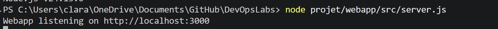

Une fois lancé, le serveur est accessible à l'adresse :

```
http://localhost:3000
```

### Résultat

En accédant à la page principale (`/`), le CV s'affiche sous forme d'image.

Résultat attendu :
- le navigateur affiche correctement le CV

> 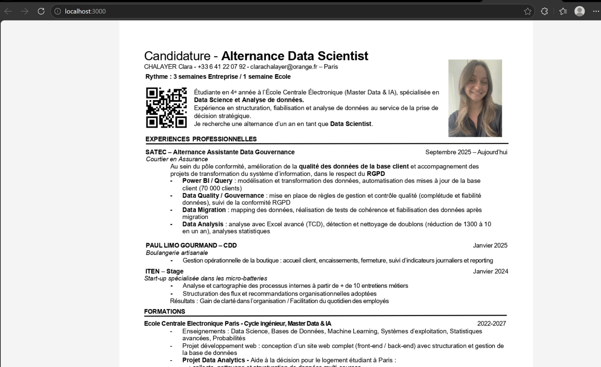

---

### Endpoint de Health Check

L'application expose un endpoint `/health` pour vérifier son bon fonctionnement.

URL :

```
http://localhost:3000/health
```

Résultat attendu :

```json
{"status":"OK"}
```

Cela permet de confirmer que le serveur tourne correctement.

> 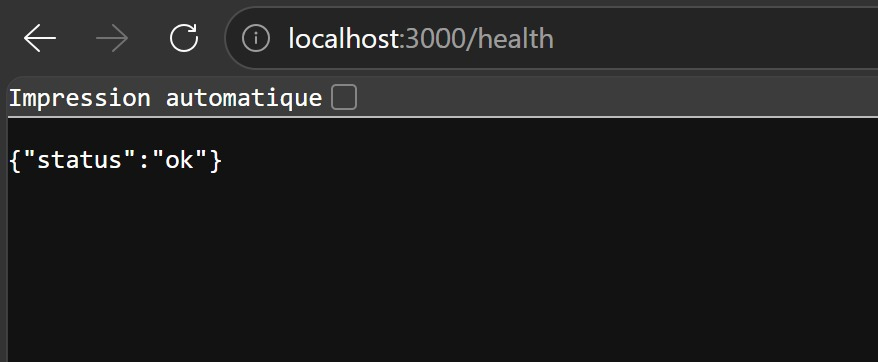

---

## 2. Tests Automatisés

### Description

Nous avons mis en place des tests automatisés pour vérifier le bon fonctionnement de l'application.
Ces tests permettent de :
- vérifier que la page principale répond correctement (code HTTP 200)
- vérifier que l'endpoint `/health` retourne un statut valide

---

### Lancement des Tests

Pour exécuter les tests :

```bash
npm test
```

---

### Résultats

Les tests doivent s'exécuter sans erreur et afficher un résultat positif.

```
PASS test/app.test.js
```

> 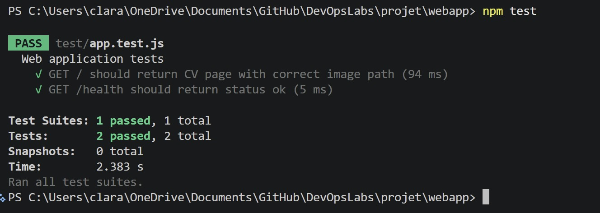

---

## 3. Structure du Projet

Le projet est organisé de la façon suivante :

```
projet/
  webapp/
    public/
      CV.jpg
    src/
      app.js
      server.js
    test/
      app.test.js
```

Description des dossiers :
- `public/` : contient les fichiers statiques (image du CV)
- `src/` : contient le code source de l'application
- `test/` : contient les tests automatisés

> 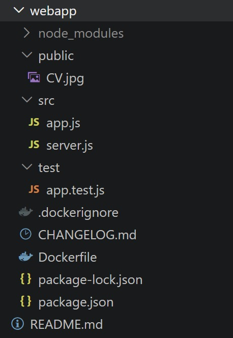

---

## 4. Pipeline CI/CD

### Description

Nous avons mis en place un pipeline CI/CD avec GitHub Actions.
Ce pipeline permet de :
- vérifier automatiquement que les tests passent à chaque push
- garantir que le code sur la branche `main` est toujours fonctionnel

### Déclenchement

Le pipeline se déclenche automatiquement à chaque push ou pull request sur la branche `main`.

### Étapes du Pipeline

1. Récupération du code source (checkout)
2. Installation de Node.js 20
3. Installation des dépendances (`npm install`)
4. Exécution des tests (`npm test`)

### Fichier de Configuration

Le pipeline est défini dans `.github/workflows/main.yml`.

### Résultat Attendu

Le pipeline doit s'exécuter sans erreur et afficher un statut vert.

> 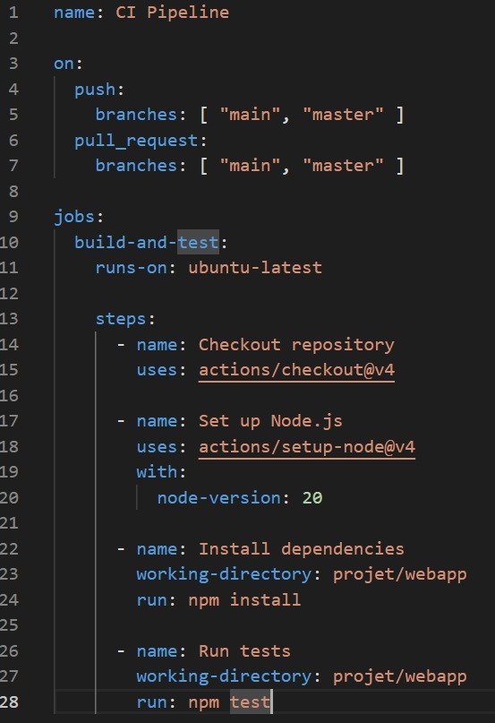

---

## 5. Vagrant

### Description

Nous avons créé une machine virtuelle Linux avec Vagrant et VirtualBox.
Cette VM permet de reproduire un environnement de déploiement identique pour tous les membres du projet.

> 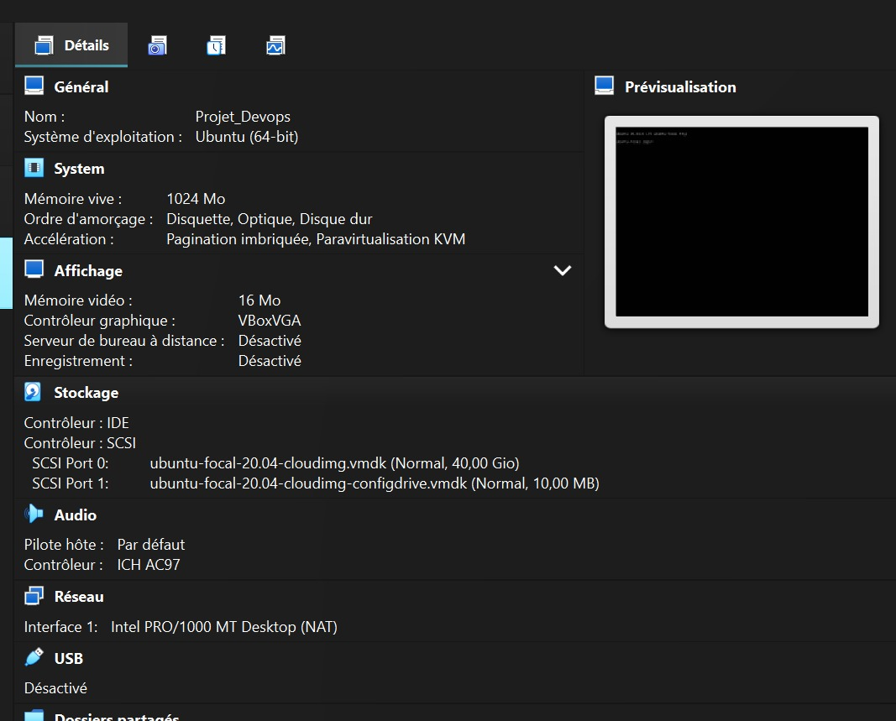
> 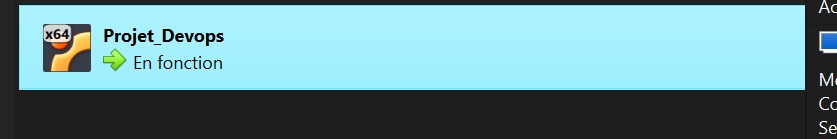

### Configuration

- Box : `ubuntu/focal64`
- Mémoire : 1024 Mo
- Redirection de port : 3000 (VM) → 3000 (hôte)
- Dossier partagé : `webapp/` monté sur `/home/vagrant/webapp`

### Démarrage

Pour lancer la VM :

```bash
cd projet/iac
vagrant up
```

> 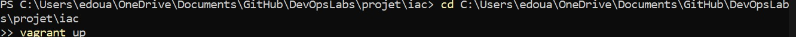

### Vérification

Pour vérifier que la VM est en cours d'exécution :

```bash
vagrant status
```

### Résultat Attendu

La VM démarre correctement et le dossier webapp est accessible depuis la VM.

> 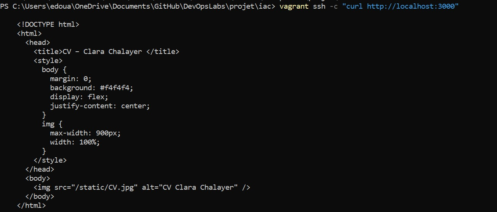

---

## 6. Ansible

### Description

Nous avons utilisé Ansible pour provisionner automatiquement la VM.
Le provisionnement est effectué via `ansible_local`, ce qui signifie qu'Ansible s'installe et s'exécute directement depuis la VM, sans nécessiter d'installation sur la machine hôte.

### Tâches Exécutées

1. Mise à jour du cache apt
2. Installation de Node.js et npm
3. Installation des dépendances de l'application (`npm install`)
4. Démarrage de l'application

### Fichier de Configuration

Le playbook est défini dans `iac/playbooks/playbook.yml`.

### Résultat Attendu

Une fois le provisionnement terminé, l'application est accessible depuis la VM :

```bash
curl http://localhost:3000
curl http://localhost:3000/health
```

Résultats attendus :
- `/` : affiche le HTML du CV
- `/health` : retourne `{"status":"ok"}`

> 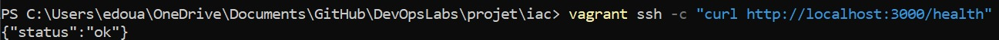

> 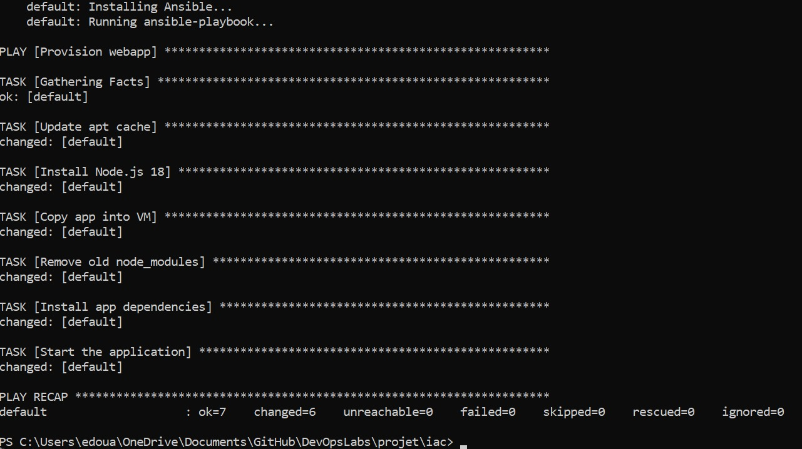

---

## 7. Docker

### Description

Nous avons conteneurisé l'application avec Docker afin de garantir son exécution de manière cohérente dans n'importe quel environnement.

### Dockerfile

Le `Dockerfile` se trouve dans `webapp/Dockerfile`.

### Construction de l'Image

```bash
cd projet/webapp
docker build -t myapp .
```

> 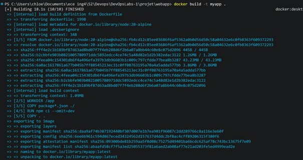

### Lancement du Conteneur

```bash
docker run -p 3000:3000 myapp
```

L'application est alors accessible à l'adresse :

```
http://localhost:3000
```

> 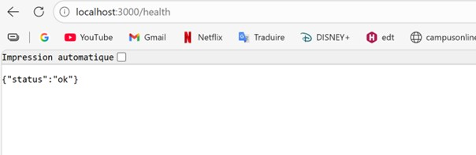

### Docker Hub

L'image est disponible publiquement sur Docker Hub :

```
https://hub.docker.com/r/TON_USERNAME/myapp
```

Pour télécharger et lancer l'image directement :

```bash
docker pull chloelstc/myapp:latest
docker run -p 3000:3000 chloelstc/myapp:latest
```

> 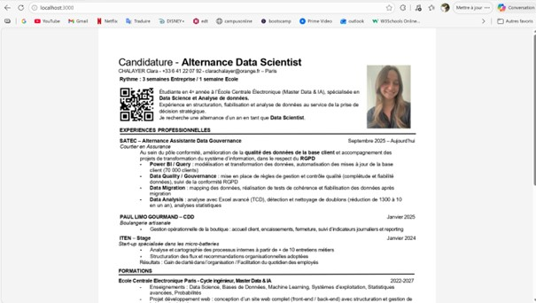

---

## 8. Kubernetes

### Description

Nous avons déployé l'application sur un cluster Kubernetes local avec Minikube.

### Prérequis

- [Minikube](https://minikube.sigs.k8s.io/docs/start/) installé
- [kubectl](https://kubernetes.io/docs/tasks/tools/) installé
- Docker Desktop en cours d'exécution

### Démarrage de Minikube

```bash
minikube start --driver=docker
```

> 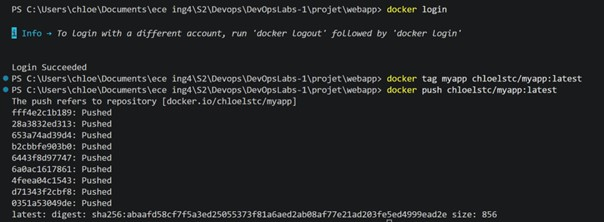
> 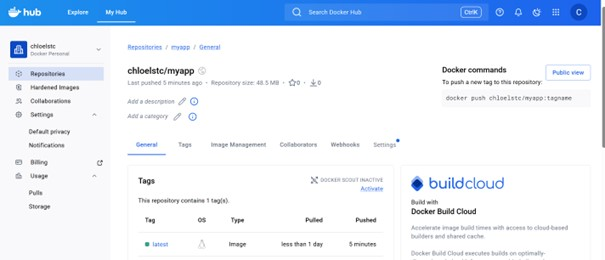

### Fichiers Manifestes

Les manifestes Kubernetes se trouvent dans le dossier `k8s/` :
- `k8s/deployment.yaml` : définit le déploiement de l'application (2 réplicas)
- `k8s/service.yaml` : expose l'application via un NodePort

### Déploiement de l'Application

```bash
kubectl apply -f k8s/deployment.yaml
kubectl apply -f k8s/service.yaml
```

> 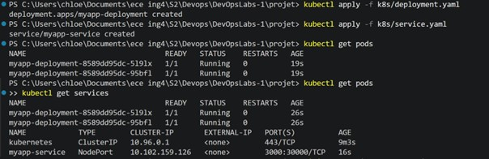

### Vérification du Déploiement

```bash
kubectl get pods
kubectl get services
```

> 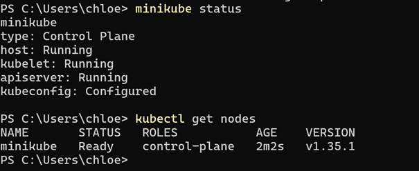

### Accès à l'Application

```bash
minikube service myapp-service
```

Cette commande ouvre automatiquement l'application dans le navigateur.

> 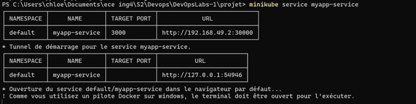
> 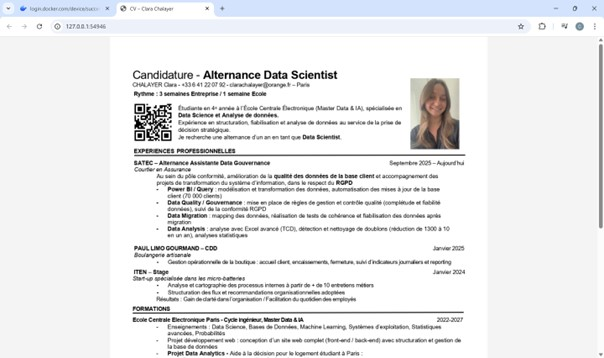

---

## 9. Difficultés Rencontrées

### CI/CD — GitHub Actions

Lors de la mise en place du pipeline CI/CD, nous avons rencontré plusieurs problèmes.

Le premier concernait un ancien fichier de workflow `node.js.yml` lié à un TP précédent, qui pointait vers un dossier inexistant. Ce fichier déclenchait un pipeline en échec à chaque push. La solution a été de le supprimer et de ne conserver que notre pipeline `main.yml`.

Le deuxième problème portait sur l'emplacement de `main.yml`. Nous l'avions placé dans `projet/.github/workflows/` alors que GitHub Actions ne reconnaît les workflows que s'ils se trouvent à la racine du dépôt dans `/.github/workflows/`. Une fois le fichier déplacé au bon endroit, le pipeline s'est exécuté correctement.

Le troisième problème concernait le chemin `working-directory` dans le fichier de workflow. Nous avons dû indiquer `projet/webapp` plutôt que simplement `webapp`, car le code source se trouve dans un sous-dossier du dépôt.

### Vagrant

La principale difficulté rencontrée avec Vagrant a été une interruption accidentelle du démarrage de la VM avec `Ctrl+C`. Cela a créé un verrou empêchant tout nouveau lancement avec le message `another process is already executing an action`. La solution a été d'attendre que le processus se termine naturellement avant de relancer `vagrant up`.

Nous avons également noté un avertissement lié à une incompatibilité de version entre les VirtualBox Guest Additions (6.1.50) et VirtualBox lui-même (7.2), mais cela n'a pas empêché le projet de fonctionner correctement.

### Ansible

Le provisionnement automatique via Ansible n'a pas installé correctement les dépendances Node.js lors du premier lancement. Le module `npm` d'Ansible n'a pas fonctionné comme attendu, empêchant l'application de démarrer avec l'erreur `Cannot find module 'express'`. La solution a été de remplacer le module `npm` par une commande `npm install` directe via le module `command` d'Ansible, ce qui a résolu le problème.

### Docker

Docker Desktop ne démarrait parfois pas automatiquement sur Windows. La solution a été de lancer Docker Desktop en tant qu'administrateur et de s'assurer que WSL2 était à jour via `wsl --update`.

### Kubernetes

Les commandes `minikube` et `kubectl` n'étaient pas reconnues dans le terminal intégré de VS Code après leur installation. Cela était dû à la variable d'environnement PATH qui n'avait pas été rechargée. La solution a été de redémarrer complètement VS Code pour que le terminal prenne en compte le PATH mis à jour.

---

## 10. Auteurs

- **Clara** — Application web, tests
- **Édouard** — Pipeline CI/CD, Vagrant, Ansible
- **Chloé** — Docker, Kubernetes, finalisation du README